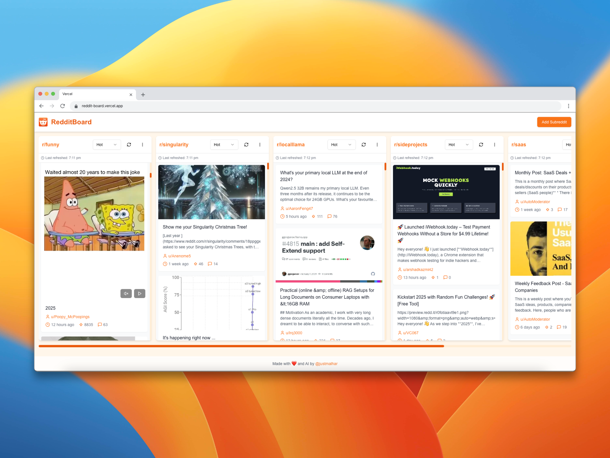

#  RedditBoard


## Overview
**RedditBoard** is a new way of browsing Reddit with an elegant, Trello-inspired dashboard that puts you in control. Experience Reddit in a whole new way with our intuitive column-based interface that emphasizes clarity and efficiency.

Built for both casual browsers and power users alike, RedditBoard transforms chaotic Reddit feeds into an organized workspace. Monitor multiple communities simultaneously, track trending discussions, and curate your perfect Reddit experience - all from one seamless dashboard.

## Key Features
- **🎯 Powerful Column-Based Layout**:
  - View multiple subreddits side-by-side in customizable columns
  - Sort each column independently (Hot, New, Top, Rising) with flexible time filters

- **🎬 Enhanced Media Experience**:
  - Seamlessly play videos and view images inline
  - Smart media controls for a distraction-free browsing experience
  - Optimized loading and performance

- **⚡ Real-Time Updates**:
  - Stay current with automatic feed refreshing
  - Visual indicators for new content
  - Timestamp tracking for each refresh

- **🗂️ Smart Organization**:
  - Add unlimited subreddit columns
  - Sort posts by upvotes or comment count within each column
  - Quick column management with intuitive controls

- **📱 Responsive & Accessible**:
  - Fully responsive design works beautifully on any device
  - Touch-optimized for mobile browsing
  - Clean, high-contrast interface for improved readability

- **✨ No Ads or Clutter**:
  - Browse Reddit without ads or visual clutter
  - Enjoy a clean, distraction-free browsing experience

## Live Demo
Check out the live version of RedditBoard:
👉 [reddit-board.vercel.app](https://reddit-board.vercel.app)

## Quick Deployment on Vercel
Deploy RedditBoard with a single click using Vercel's powerful and scalable environment.

[](https://vercel.com/new/clone?repository-url=https://github.com/justmalhar/reddit-board)

## Quick Start

### Prerequisites
- Node.js (Latest LTS version recommended)

### Installation
```bash
# Clone the repository
git clone https://github.com/Justmalhar/reddit-board.git

# Navigate to the project directory
cd reddit-board

# Install dependencies
npm install

# Start the development server
npm run dev
```

Visit `http://localhost:3000` to see the application running.

## Development Commands
| Command | Description |
|---------|-------------|
| `npm run dev` | Start development server |
| `npm run build` | Create production build |
| `npm run start` | Start production server |
| `npm run lint` | Run ESLint for code quality |

## Detailed Tech Stack
| Technology | Version | Purpose |
|------------|---------|----------|
| Next.js | Latest | React framework |
| TypeScript | Latest | Type safety |
| Tailwind CSS | Latest | Styling |
| Reddit RSS API | - | Content fetching |

## Contributing
We welcome contributions! Here's how you can help:

1. Fork the repository
2. Create a feature branch (`git checkout -b feature/AmazingFeature`)
3. Commit your changes (`git commit -m 'Add some AmazingFeature'`)
4. Push to the branch (`git push origin feature/AmazingFeature`)
5. Open a Pull Request

## License
This project is licensed under the MIT License - see the [LICENSE](LICENSE) file for details.

## Acknowledgments
- Built with [Next.js](https://nextjs.org/)
- Styled with [Tailwind CSS](https://tailwindcss.com/)
- Powered by Reddit RSS API (We are not affiliated with Reddit)

---

## Stay Connected
- **Twitter/X**: [@justmalhar](https://twitter.com/justmalhar) 🛠
- **LinkedIn**: [Malhar Ujawane](https://linkedin.com/in/justmalhar) 💻

Made with ❤️ and AI by [@justmalhar](https://twitter.com/justmalhar)